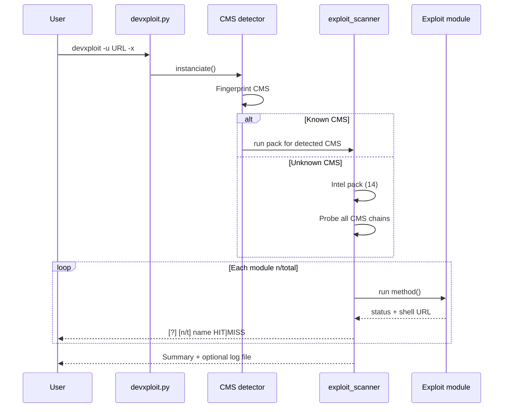

<p align="center">
  <a href="https://github.com/zado-os/devxploit"></a>
  <br>
  <strong>DevXploit</strong> — ZADO-OS Roger OS Edition
  <br>
  <sub>CMS exploit framework · intel probes · shell injection · dorks · DNS</sub>
</p>

<p align="center">
  
  
  
  
  <a href="https://github.com/zado-os/devxploit">
    
  </a>
</p>

<p align="center">
  <a href="https://github.com/zado-os/devxploit/archive/refs/heads/main.zip">Download ZIP</a> •
  <a href="https://github.com/zado-os/devxploit">Repository</a> •
  <a href="https://github.com/zado-os/devxploit/issues">Issues</a> •
  <a href="https://github.com/anouarbensaad/vulnx/wiki/Usage">Upstream VulnX Wiki</a>
</p>

---

## Overview

**DevXploit** is an automated CMS assessment framework maintained by **ZADO-OS (Roger OS)**. It fingerprints the target stack, runs chained exploit modules with `[n/total]` progress, validates upload/shell paths, and exports results. The console layout is inspired by professional exploit frameworks (structured `[*]` / `[+]` / `[-]` lines) while remaining a distinct, lightweight Python tool—not a Metasploit clone.

Fork lineage: [anouarbensaad/vulnx](https://github.com/anouarbensaad/vulnx) → ZADO-OS hardening, **DevXploit** branding, expanded module packs, and fixed multipart uploads.

**Repository:** [github.com/zado-os/devxploit](https://github.com/zado-os/devxploit)

```bash
git clone https://github.com/zado-os/devxploit.git
cd devxploit
python3 -m pip install -r requirements.txt
chmod +x devxploit
./devxploit -u https://example.com --exploit-scan -o ./logs
```

> **Kali / Debian:** Always use `python3` and `pip3` (or `python3 -m pip`). The default `pip` command may point to Python 2.7.

---

## Architecture

```mermaid
flowchart TB
    subgraph CLI["Entry layer"]
        DX[devxploit / devxploit.py]
        ARG[argparse flags]
        BAN[common/banner.py]
    end

    subgraph Core["Orchestration"]
        DET[modules/detector.py CMS]
        EXS[modules/exploits/exploit_scanner.py]
    end

    subgraph Packs["Exploit packs"]
        INTEL[intel_exploits.py — 14 probes]
        WP[wordpress_exploits.py + wordpress_extra — 33]
        JOO[joomla_exploits.py — 19]
        PS[prestashop_exploits.py — 28]
        DR[drupal_exploits.py — 8]
        OC[opencart_exploits.py — 6]
        LM[lokomedia_exploits.py — 6]
        MG[magento_exploits.py — 5]
    end

    subgraph Exec["Executors"]
        E1[executor/Wordpress.py]
        E2[executor/Joomla.py]
        E3[executor/Prestashop.py]
        E4[executor/Drupal.py]
        E5[executor/Opencart.py]
        E6[executor/Magento.py]
        E7[executor/Lokomedia.py]
    end

    subgraph Support["Shared services"]
        BR[common/branding.py]
        PT[common/paths.py + shell/]
        HTTP[common/http_session.py]
        EH[common/exploit_http.py]
        COL[common/colors.py]
    end

    subgraph Extra["Optional features"]
        DORK[modules/dorks/]
        DNS[modules/dns_dump.py]
        PORT[modules/scan_ports.py]
        GATH[modules/gathering/]
    end

    DX --> ARG --> DET
    DX --> BAN
    DET --> EXS
    EXS --> INTEL & WP & JOO & PS & DR & OC & LM & MG
    DET --> E1 & E2 & E3 & E4 & E5 & E6 & E7
    E1 --> WP
    E2 --> JOO
    EXS --> PT & HTTP & EH & COL & BR
    DET --> DORK & DNS & PORT & GATH
```



### Scan flow (`-x` / `--exploit-scan`)



---

## Features

| Area | Capability |
|------|------------|
| CMS detection | WordPress, Joomla, PrestaShop, Drupal, OpenCart, Lokomedia, Magento |
| Exploits Scan | **119** modules across 8 packs (incl. intel + WP extras) |
| Intel pack | `.git`, `.env`, phpinfo, wp-config backups, XML-RPC, Timthumb, PHPUnit, Adminer, phpMyAdmin, SQL dumps, Swagger, Spring Actuator, debug logs, WP REST users |
| Shell payloads | `shell/DevXploit.php` (+ html/txt/gif) — query `?DevXploit=1` |
| Output | `[n/total]` lines, `HIT` / `MISS` markers, `-o` log export |
| Recon | Dorks, DNS dump, port scan, subdomain/web gathering |
| Interactive | `devxploit --it` console (readline on Linux) |

### Module counts by pack

| Pack | Modules | Example command |
|------|---------|-----------------|
| Intel | 14 | Always runs first on unknown CMS; `devxploit --exploit-cms intel` |
| WordPress | 33 | `devxploit -u URL --exploit-cms wordpress` |
| Joomla | 19 | `devxploit -u URL --exploit-cms joomla` |
| PrestaShop | 28 | `devxploit -u URL --exploit-cms prestashop` |
| Drupal | 8 | `devxploit -u URL --exploit-cms drupal` |
| OpenCart | 6 | `devxploit -u URL --exploit-cms opencart` |
| Lokomedia | 6 | `devxploit -u URL --exploit-cms lokomedia` |
| Magento | 5 | `devxploit -u URL --exploit-cms magento` |
| **All** | **119** | `devxploit -u URL --exploit-cms all` |

List modules: `devxploit --list-exploits all`

---

## Quick start (Kali Linux)

```bash
cd ~/Desktop/tools/devxploit   # or your clone path
git pull
python3 -m pip install -r requirements.txt --break-system-packages
chmod +x devxploit install.sh
./devxploit -u https://target.example -x -o ./logs
```

System-wide install:

```bash
sudo ./install.sh
devxploit -u https://target.example -x
```

| Problem | Solution |
|---------|----------|
| `devxploit: command not found` | Run `./devxploit` from the project dir or `sudo ./install.sh` |
| `pip` uses Python 2.7 | Use `python3 -m pip install -r requirements.txt` |
| Joomla `form-data` errors | Fixed in v3.1 — update repo; headers are no longer corrupted between modules |

---

## CLI reference

```
usage: devxploit [options]

  -u, --url URL           Target URL
  -x, --exploit-scan      Run Exploits Scan (recommended)
  -e, --exploit           Alias for exploit scan
  --exploit-cms PACK      Force one pack: intel|wordpress|joomla|prestashop|
                          drupal|lokomedia|opencart|magento|all
  --list-exploits PACK    Print module catalog
  -o, --output DIR        Write exploits_*.log files
  --cms                   CMS metadata (themes, plugins, users)
  -w, --web-info          Web recon
  -d, --domain-info       Subdomain enum
  --dns                   DNS information
  -p, --ports N           Port scan
  -D, --dorks QUERY       Search engine dorks
  -l, --dork-list CMS     List built-in dork names
  --it                    Interactive console
  -i, --input FILE        Batch URLs from file
```

Examples:

```bash
devxploit -u https://site.tld -x
devxploit -u https://site.tld --exploit-cms wordpress -o ./out
devxploit --list-exploits joomla
devxploit --it
```

---

## Project layout

```
devxploit.py              Main entry (only)
devxploit                 Bash launcher → python3 devxploit.py
common/
  branding.py             App name, repo, shell filenames
  banner.py               Console banner (MSF-style layout)
  colors.py               [*] [+] [-] palette
  paths.py                Resolve shell/ from any cwd
  http_session.py         Safe multipart uploads
  exploit_http.py         Shell probe helpers
modules/
  detector.py             CMS routing
  exploits/
    exploit_scanner.py    Chains, progress, summaries
    intel_exploits.py     Cross-CMS intel
    wordpress_exploits.py Core WP chain
    wordpress_extra.py    Additional WP/CVE probes
    joomla_exploits.py    Joomla components
    prestashop_exploits.py
    drupal_exploits.py
    opencart_exploits.py
    magento_exploits.py
    lokomedia_exploits.py
  executor/               Per-CMS runners
  dorks/                  Search operators
  gathering/              CMS-specific intel
  cli/                    Interactive mode
shell/
  DevXploit.php           Upload payload
  DevXploit.html / .txt / .gif
install.sh / update.sh
docker/Dockerfile
bin/devxploit.desktop
```

---

## Docker

```bash
git clone https://github.com/zado-os/devxploit.git
cd devxploit
docker build -t devxploit ./docker/
docker run -it --rm devxploit -u http://example.com -x
docker run -it -v "$PWD:/devxploit" devxploit -u http://example.com -x -o /devxploit/logs
```

---

## Windows & Termux

**Windows:** Install Python 3, then `python devxploit.py -u URL -x` from the project folder.

**Termux:** `pkg install python git` → clone repo → `pip install -r requirements.txt` → `python devxploit.py -u URL -x` or run `install.sh` as root in Termux.

---

## Legal & ethics

Use only on systems you own or are explicitly authorized to test. Unauthorized access is illegal. Maintainers provide this software for defensive research and sanctioned penetration tests.

---

## Credits & license

| Role | Name |
|------|------|
| Maintainer | **ZADO-OS** (Roger OS) |
| Upstream | [Anouar Ben Saad — VulnX](https://github.com/anouarbensaad/vulnx) |

Licensed under [GPL-3.0](LICENSE).
